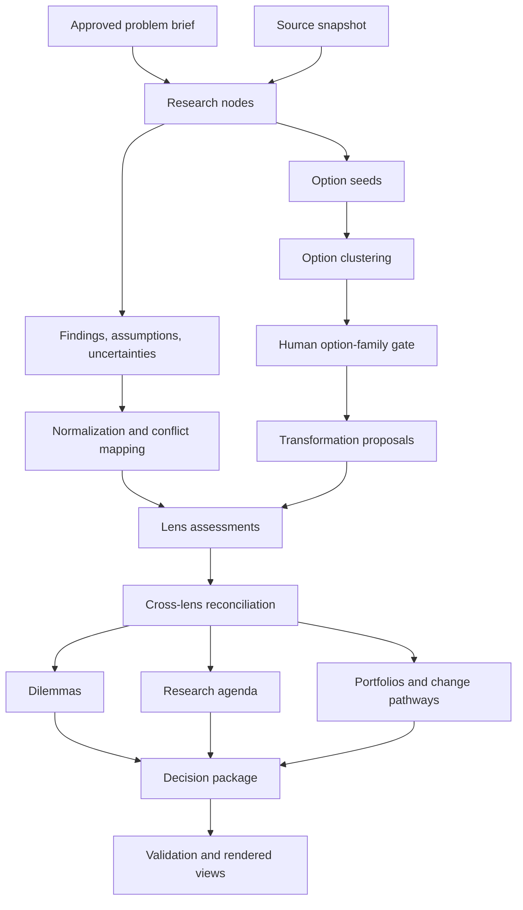
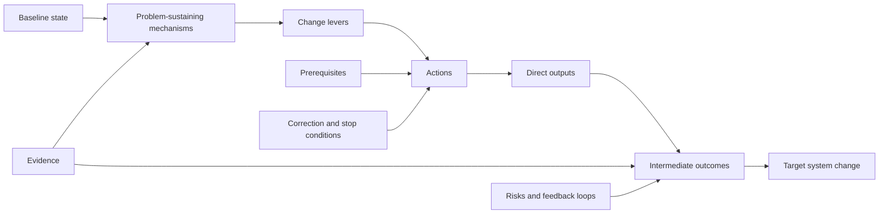
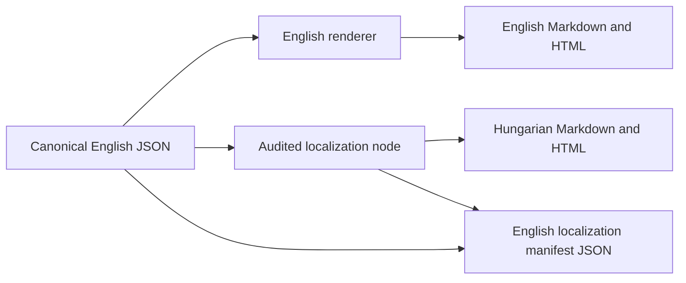

# Education Policy Lab v2 — Artifact-First Transformation DAG

Status: **IMPLEMENTATION STARTED — owner direction, 2026-07-20.**

Implementation branch: `codex/artifact-dag-v2`

Date: 2026-07-20

This document is the complete product, domain, data, and execution
architecture specification for Education Policy Lab v2. It describes a clean
rewrite, not an incremental refactor of the current pipeline. The v1 code,
decision log, and outputs remain an immutable audit legacy, research record,
and comparison corpus.

Related existing decisions and issues: D-24, D-30–D-36; #6, #7, #9, #20,
#22, #24, #26–#33. V2 preserves the underlying governance and safety
principles where they still apply, but it does not promise implementation or
artifact-schema compatibility with v1.

Reading map:

- **Sections 1–5:** decision, mission, goals, and principles;
- **Sections 6–15:** the two DAGs, domain model, and content workflow;
- **Sections 16–18:** execution architecture, providers, and validation;
- **Sections 19–20:** human governance, localization, and public product;
- **Sections 21–30:** v1 boundary, code structure, tests, migration, issues,
  trade-offs, and approval decisions.

## 1. Executive Decision

The central abstraction in v2 is not a set of expert or stakeholder agents
talking to one another. It is a graph of **traceable, structured knowledge and
transformation artifacts**.

Agents and models are processors. They perform research tasks, apply
scientific or professional lenses, cluster records, critique proposals, or
validate outputs. Their identity and execution context remain available as
provenance, but they are not part of the substantive policy claim. The system
does not say:

> Expert X believes Y.

It says:

> Claim or effect Y is supported to a stated degree under specified
> conditions, sources, assumptions, and uncertainties; it has these
> implications for the available transformation directions; and these
> residual value choices remain for humans.

The durable product of v2 is a continuously growing, human-governed,
auditable **education transformation library**. Briefs, websites, SWOT views,
and reports are projections of that library, not independent sources of
truth.

## 2. Mission

The mission of Education Policy Lab v2 is:

> To discover, construct, and evaluate auditable, evidence-grounded education
> transformation directions, reusable change patterns, and context-specific
> proposals through multiple scientific and professional lenses, while making
> uncertainty, implementation risk, transferability limits, and
> evidence-insoluble value dilemmas explicit.

Every topic must move through three layers:

```text
Knowledge → Decision space → Change
```

- **Knowledge:** What is known, how it is known, what conflicts, and what is
  unknown.
- **Decision space:** Which alternatives, conditions, trade-offs, and genuine
  value choices exist.
- **Change:** Which interventions, components, portfolios, pilots, and
  transition pathways are possible.

AI does not choose the final policy, assert a political preference, or replace
democratic and professional decision-making. Its job is to make the knowledge
and transformation space faster to construct, easier to audit, and easier to
criticize.

## 3. Success Criteria

V2 succeeds when it can take an approved education-policy problem and:

1. produce sourced, atomic findings, assumptions, and uncertainties;
2. normalize them without erasing disagreement, scope, or context;
3. discover transformation seeds through multiple research lenses;
4. cluster those seeds into a transparent option space;
5. turn human-approved option families into context-specific proposals,
   variants, and portfolios;
6. evaluate every proposal through relevant scientific, professional,
   implementation, and normative lenses;
7. separate evidence-resolvable disputes from residual value conflicts;
8. produce a research agenda, a decision-readiness verdict, and an actionable
   change map;
9. make the full creation and transformation lineage of every record
   inspectable;
10. run the same question-independent core across multiple topics;
11. contribute reusable transformation patterns to a governed shared library.

## 4. Non-Goals

The first v2 release does not aim to:

- make a political decision or declare one technically correct policy;
- simulate the reactions of real people, social groups, or organizations with
  LLM role-play;
- weigh claims by expert headcount, majority, or minority status;
- reproduce every v1 feature or artifact;
- compare v1 and v2 round scores numerically;
- modify its own prompts or architecture automatically;
- introduce a general workflow framework, vector database, message queue,
  persistent query database, or distributed executor;
- admit knowledge, lenses, or transformation patterns without human approval;
- replace real stakeholder participation with modeled voices;
- optimize against a single total score;
- generate implementation claims that exceed the evidence and readiness of a
  proposal.

## 5. Non-Negotiable Principles

### 5.1 Artifact-first

The primary unit is a structured artifact. Every semantic artifact is stored
as schema-valid, canonically serialized **JSON**. Markdown, HTML, tables, SWOT
views, and briefs are deterministic or audited renderings.

YAML is not a canonical artifact format.

### 5.2 English-only internal system

The internal system has one language: English.

- Architecture and technical documentation are English.
- Code, identifiers, comments, docstrings, logs, and error messages are
  English.
- JSON field names, enum values, ids, metadata, and semantic text values are
  English.
- Prompts and agent/node specifications are English.
- Canonical artifact schemas contain no parallel language fields.

Hungarian and other languages exist only in the presentation/localization
layer. Localized content is derived from canonical English artifacts and can
never be used as an upstream policy input unless it is separately admitted as
a source.

### 5.3 Complete provenance

Every record must resolve to:

- its input artifacts;
- the node, spec, schema, and relevant configuration that produced it;
- the exact prompt sent to the provider;
- provider, model, role, and generation parameters;
- sources and source snapshots;
- validation results;
- rejected attempts and rejection reasons;
- wall time, token usage, and estimated cost;
- human gate decisions that affected it.

### 5.4 Content coverage, not speaker coverage

It is not sufficient for every lens name to appear in a synthesis. Every input
finding, option seed, and assessment must have a recorded disposition:

- carried forward;
- merged as a duplicate;
- preserved as conflicting;
- marked evidence-insufficient;
- marked out of scope;
- routed to human review;
- rejected with a reason.

Silent attrition is prohibited.

### 5.5 Scientific lens, not expert vote

Psychology, economics, law, sociology, and other perspectives remain first-
class. They are represented as versioned methodological contracts, not
personas. Lenses do not vote, and adding more lenses cannot increase a claim's
weight by headcount.

### 5.6 Evidence and value separation

Every conflict must be decomposed into, where applicable:

- an empirically testable claim;
- a causal or predictive assumption;
- an implementation constraint;
- a distributional consequence;
- a residual value, right, or political conflict.

### 5.7 Transformation orientation

A topic cannot end with only a problem map or debate map. It must produce at
least transformation directions and state honestly whether each direction is
only a hypothesis, conceptually specified, pilot-ready, or scale-ready.

### 5.8 Human gates

Knowledge admission, topic framing, shared lens admission, transformation-
library admission, value choices, and external use of final proposals remain
human decision rights.

### 5.9 Cross-family generator and judge

A model family may not evaluate its own generated artifact. Verification uses
actual node provenance, not provider defaults from configuration.

### 5.10 Public-repository safety

Secrets, personal data, and non-redistributable documents may not enter the
repository. A document with unclear rights is stored only as a pointer and
metadata record.

## 6. Two Distinct DAGs

V2 manages two connected but conceptually separate graphs.

### 6.1 Execution and provenance DAG

This graph describes how artifacts were produced:



### 6.2 Policy change DAG

This graph describes the causal and implementation logic of a proposal:



The execution DAG provides reproducibility. The policy change DAG provides an
interpretable theory of change. They must never be conflated.

## 7. Shared Domain Conventions

### 7.1 Stable semantic ids

| Prefix | Record type |
|---|---|
| `F` | Finding |
| `A` | Assumption |
| `U` | Uncertainty |
| `C` | CanonicalClaim |
| `EC` | EvidenceConflict |
| `OS` | OptionSeed |
| `TF` | TransformationFamily |
| `TP` | TransformationPattern |
| `PR` | TransformationProposal |
| `V` | ProposalVariant |
| `AS` | LensAssessment |
| `D` | Dilemma |
| `RQ` | ResearchQuestion |
| `PF` | TransformationPortfolio |
| `DP` | DecisionPackage |
| `SRC` | Source |
| `PV` | Provenance |

A semantic id and a content hash are different identifiers. The semantic id
provides continuity; the content hash identifies one exact immutable version.

### 7.2 Record envelope

Every canonical semantic record uses a common envelope:

```json
{
  "id": "F12",
  "record_type": "finding",
  "schema_version": "2.0.0",
  "topic": "early-selection",
  "status": "candidate",
  "content": {},
  "provenance_ref": "PV-a81d",
  "created_at": "2026-07-20T12:00:00Z",
  "supersedes": null
}
```

Provenance is separate from substantive content but mandatory and resolvable.

### 7.3 Lifecycle states

```text
candidate → reviewed → admitted → superseded | rejected | retired
```

- A model may create only `candidate` records.
- Automated validation may advance a record to `reviewed`.
- Only a human gate may assign `admitted` in shared catalogs.
- Earlier versions are never deleted; `supersedes` preserves history.

### 7.4 Logical artifact database

V2 is logically an **immutable, versioned document-graph database**:

- nodes are JSON artifacts;
- edges are typed id references in those artifacts;
- every new version is a new node connected by `supersedes`;
- execution events form an append-only event stream;
- run manifests and decision packages are graph roots.

The canonical database is a content-addressed JSON artifact store committed to
Git. The first release has no persistent secondary query index. A repository
layer reads schema-valid JSON and may construct in-memory indexes by id, type,
topic, status, and relation.

### 7.5 Canonical storage formats

| Data type | Canonical format |
|---|---|
| Semantic domain artifact | `.json` |
| Node, run, and provenance manifest | `.json` |
| Human gate decision | `.json` |
| Append-only execution events | `.jsonl` |
| JSON Schema | `.schema.json` |
| Prompt | content-addressed `.txt.gz` plus JSON metadata |
| Raw source document | original format plus English JSON metadata/pointer |
| Human technical documentation | English Markdown |
| Localized public content | derived locale-specific Markdown/HTML/PO |

JSON artifacts use stable key ordering and normalized whitespace so content
hashes are reproducible. Floats, dates, units, currencies, nulls, and enum
values are accepted only in schema-defined representations.

### 7.6 JSON Schema discipline

A file-based artifact database works only with strict, versioned schemas:

- one versioned JSON Schema per `record_type`;
- `additionalProperties: false` on every object;
- semantically required fields are structurally required;
- closed and documented enums;
- type-specific id patterns;
- typed reference fields such as `finding_ids` and `proposal_ids`;
- explicit discriminators for polymorphic records;
- shared definitions for recurring evidence, status, date, unit, and money
  structures;
- schema changes create new versions instead of silently reinterpreting data;
- every migration is an explicit, tested `vN → vN+1` transformation;
- examples are valid fixtures tested against the schema.

JSON Schema validates one document. A separate graph verifier enforces cross-
record invariants:

- every referenced id exists and has the expected type;
- forbidden cycles do not exist;
- `supersedes` chains are consistent;
- coverage ledgers are complete;
- run roots resolve;
- artifact and provenance references are mutually consistent;
- only admitted records enter canonical public catalogs.

## 8. Input and Research Records

### 8.1 `ProblemBrief`

The human-approved topic input contains:

- title and public question;
- problem statement;
- learning goals;
- scope and explicit exclusions;
- affected system and decision levels;
- relevant time horizon;
- optional seed sources;
- explicit human goals and constraints;
- known value tensions as hypotheses, not settled claims.

All canonical text is English.

### 8.2 `SourceSnapshot`

A source snapshot records:

- the exact registry and library versions used;
- web search queries;
- returned URLs, titles, and access timestamps;
- excerpts actually provided to a model;
- license and redistribution status;
- search failures, partial results, and outages.

A web result does not automatically become an admitted registry fact.

### 8.3 `Finding`

A finding is an atomic, inspectable claim:

```json
{
  "id": "F12",
  "claim": "Delayed selection is associated with lower between-school stratification in comparable systems.",
  "kind": "fact",
  "domain_tags": ["education_economics"],
  "evidence_strength": "moderate",
  "source_refs": ["SRC-81"],
  "population": "Students in tracked European school systems",
  "context": "Cross-country and reform-study evidence",
  "time_scope": "Medium-term educational outcomes",
  "transferability": "uncertain",
  "limitations": ["Institutional contexts differ materially."],
  "assumption_ids": [],
  "uncertainty_ids": []
}
```

A finding does not contain an overall policy recommendation or expert
position.

### 8.4 `Assumption`

An assumption records a premise required by a claim or proposal but not
established as fact:

- statement;
- affected artifact ids;
- testability;
- criticality;
- consequence if false;
- evidence that could test it.

### 8.5 `Uncertainty`

Supported categories:

- known uncertainty;
- data gap;
- research gap;
- local-knowledge gap;
- transferability uncertainty;
- implementation uncertainty;
- cost or capacity uncertainty;
- political or stakeholder uncertainty;
- value question;
- potential unknown unknown.

An uncertainty states what could reduce it, who may hold the missing
information, and whether it is decision-critical.

### 8.6 `OptionSeed`

An option seed is a change idea proposed by a research lens but not yet a
canonical proposal. It contains:

- concise direction;
- target problem or sustaining mechanism;
- hypothesized change lever;
- possible actions;
- intended outcome;
- evidence and assumption references;
- known related or conflicting ideas;
- original context and scope.

Every research lens may generate findings and option seeds. No single agent
has exclusive authority over the solution space.

## 9. Evidence Graph and Normalization

### 9.1 `CanonicalClaim`

A normalization node groups semantically overlapping findings under a shared
claim while preserving:

- every source finding id;
- every source reference;
- population and context differences;
- evidence-grade differences;
- the rationale for merging.

Normalization may not create a broader or stronger claim than its inputs
support.

### 9.2 `EvidenceConflict`

An evidence conflict is created when findings cannot be safely merged:

- finding and claim ids;
- subject of the conflict;
- conflict type: measurement, population, context, time horizon,
  methodology, causal model, or incompatible result;
- evidence that could resolve it;
- current status: resolvable, partially resolvable, or unresolved;
- affected transformation proposals.

### 9.3 Coverage ledger

Every normalizer and clustering node produces a machine-verifiable coverage
ledger. Its output is valid only if the complete input-id set equals:

```text
mapped ∪ duplicate ∪ conflicting ∪ out_of_scope ∪ rejected ∪ human_review
```

## 10. Scientific and Professional Lenses

### 10.1 Lens definition

A `LensDefinition` is a versioned methodological contract, not a persona:

```json
{
  "id": "educational_psychology",
  "kind": "scientific",
  "discipline": "psychology",
  "paradigms": [
    "social_psychology",
    "motivational_psychology",
    "cognitive_load_theory"
  ],
  "examines": [
    "academic_self_concept",
    "motivation",
    "labeling_effects",
    "stereotype_threat",
    "cognitive_load"
  ],
  "preferred_evidence": [
    "meta_analysis",
    "randomized_study",
    "longitudinal_study",
    "validated_psychological_measurement"
  ],
  "required_questions": [],
  "known_blind_spots": [],
  "out_of_scope": []
}
```

### 10.2 Lens types

#### Scientific lenses

They ask what is true or likely:

- educational psychology;
- pedagogy and learning science;
- education economics;
- sociology and social mobility;
- demography;
- comparative education and reform transfer.

#### System and implementation lenses

They ask whether and how a change can work:

- law and governance;
- finance;
- school-network planning and capacity;
- implementation and change management;
- political feasibility.

#### Normative lenses

They expose the values and legitimate interests involved:

- equity;
- freedom and parental choice;
- institutional autonomy;
- children's rights;
- community sustainability;
- efficiency and fiscal responsibility.

A normative lens may not assign scientific evidence strength to its own value
judgment.

### 10.3 `LensAssessment`

A lens may assess a finding, proposal, variant, portfolio, or dilemma:

```json
{
  "id": "AS-psych-PR2",
  "lens_id": "educational_psychology",
  "target_id": "PR2",
  "relevance": "high",
  "mechanisms": [],
  "expected_effects": [],
  "risks": [],
  "assumption_ids": [],
  "uncertainty_ids": [],
  "evidence_refs": [],
  "applicability": "Students exposed to formal selection before age fourteen",
  "blind_spots": [],
  "value_dependencies": [],
  "overall_implication": "mixed_positive",
  "confidence": "medium"
}
```

`overall_implication` applies only to outcomes inside the lens's scope. It is
not a global policy vote.

### 10.4 Lens routing

Not every lens must assess every artifact. Routing has two layers:

1. a mandatory coverage matrix ensures every proposal receives
   evidence/mechanism, implementation/cost, distribution/equity, and
   counterfactual/value scrutiny;
2. relevance routing adds domain-specific lenses based on record tags and
   target mechanisms.

Routing is an auditable artifact. Omitting a seemingly relevant lens requires
a reason and may fail coverage validation.

### 10.5 Cross-lens differences

The system never counts supporters. It classifies why lenses differ:

- different outcomes;
- different populations or contexts;
- different time horizons;
- different evidence hierarchies;
- different causal models;
- genuinely conflicting empirical conclusions;
- different value interpretations of agreed consequences.

## 11. Transformation Library

### 11.1 `TransformationFamily`

A transformation family is a cluster of option seeds representing one
distinct part of the option space. It contains:

- concise title and scope;
- member option seeds;
- target problem mechanisms;
- shared change lever;
- adjacent and overlapping families;
- excluded seeds with reasons;
- coverage ledger;
- human-gate status.

It replaces the v1 frame but preserves the complete origin and clustering
rationale of every member seed.

### 11.2 `TransformationPattern`

A transformation pattern is a reusable, topic-independent change pattern:

```json
{
  "id": "TP-delayed-selection",
  "title": "Delaying institutional student selection",
  "change_lever": "admissions_and_structure",
  "target_levels": ["school_network", "system"],
  "addresses_mechanism_ids": ["C4", "C9"],
  "intended_outcomes": ["greater_equity"],
  "components": [],
  "prerequisites": [],
  "known_risks": [],
  "applicable_contexts": [],
  "contraindications": [],
  "evidence_refs": [],
  "variant_templates": [],
  "evidence_maturity": "moderate",
  "implementation_readiness": "concept"
}
```

A model can propose a candidate pattern. Only a human can admit it to the
shared transformation library.

### 11.3 `TransformationProposal`

A proposal adapts a family or reusable pattern to one topic. It contains:

- baseline and target state;
- target sustaining mechanisms;
- change levers;
- intervention components;
- actors and responsibilities;
- prerequisites;
- sequence and time horizon;
- resource and capacity requirements;
- direct and intermediate outcomes;
- expected winners, losers, and compensation;
- risks and unintended effects;
- evidence, assumption, and uncertainty references;
- success indicators;
- stop and correction conditions;
- reversibility;
- pilotability;
- lens-assessment references;
- residual dilemmas.

### 11.4 `ProposalVariant`

A variant parameterizes a proposal along topic-independent dimensions:

- intensity;
- geographic or institutional scope;
- implementation speed;
- voluntary or mandatory adoption;
- centralization level;
- compensation design;
- pilot or full-scale implementation;
- reversibility.

A status-quo or no-intervention record is an explicit comparison baseline,
even when it is not a transformation pattern.

### 11.5 `TransformationPortfolio`

System change rarely consists of one intervention. A portfolio records typed
relationships among proposals and components:

- `depends_on`;
- `complements`;
- `conflicts_with`;
- `alternative_to`;
- `enables`;
- `mitigates_risk_of`.

It also records implementation waves, critical path, decision gates,
measurement points, and feedback loops.

### 11.6 Two maturity dimensions

```text
evidence_maturity:
  hypothesis → suggestive → moderate → strong

implementation_readiness:
  direction → concept → specified → pilot_ready → scale_ready
```

These dimensions may not be collapsed into one score. A detailed design can
be evidence-weak; strong evidence can support an implementation-immature
direction.

### 11.7 Transformation lifecycle

```text
option_seed
  → candidate_family
  → approved_family
  → candidate_pattern
  → admitted_pattern
  → topic_proposal
  → assessed_variant
  → pilot_ready
  → implemented
  → observed_outcomes
  → revised_or_retired
```

`implemented` and `observed_outcomes` may be assigned only from documented
external events, never from model assertions.

## 12. Dilemmas and Resolvability

### 12.1 Conflict types

| Conflict type | Evidence-resolvable? | Primary output |
|---|---:|---|
| Factual contradiction | Usually | `EvidenceConflict`, `ResearchQuestion` |
| Causal-mechanism dispute | Partly or fully | `EvidenceConflict` |
| Predictive uncertainty | Reducible by data or pilot | `Uncertainty` |
| Implementation obstacle | Often design-fixable | Proposal revision |
| Distributional conflict | Consequences measurable; weights are not | `Dilemma` |
| Rights or principles conflict | No | `Dilemma` |
| Mixed conflict | Must be decomposed | `ResearchQuestion` + `Dilemma` |

### 12.2 Two-part resolvability test

Every dilemma candidate must answer:

1. What additional evidence could resolve or materially narrow this conflict?
2. If all parties accepted the same factual claims, would the conflict remain?

If the second answer is yes, the remainder is a residual value dilemma.

### 12.3 `Dilemma`

```json
{
  "id": "D3",
  "title": "Equity or freedom of choice?",
  "decision_question": "How much inequality is acceptable in exchange for greater parental choice?",
  "values_in_tension": ["equity", "parental_choice"],
  "proposal_ids": ["PR1", "PR3"],
  "affected_groups": [],
  "factual_premise_ids": ["C12", "C29"],
  "empirical_subquestion_ids": ["RQ4", "RQ7"],
  "what_evidence_can_clarify": "The effect of selection on achievement and mobility.",
  "what_evidence_cannot_decide": "The relative weight of equity and parental choice.",
  "resolvability": "partially_resolvable",
  "requires_human_judgment": true,
  "basis": "structurally_derived",
  "stakeholder_validation_status": "not_validated"
}
```

Allowed `basis` values:

- `documented`: derived from real human or organizational input;
- `structurally_derived`: follows from proposal consequences;
- `hypothesized_for_validation`: generated as a stress-test hypothesis that
  must be checked with real stakeholders.

A modeled reaction may never be represented as a documented position.

## 13. Research Agenda and Decision Readiness

### 13.1 `ResearchQuestion`

Every decision-critical unknown should map to:

- a precise question;
- the uncertainty or conflict it would reduce;
- required data or method;
- possible data holder;
- estimated time and resource class;
- observation, study, or pilot design;
- the decision it could change;
- critical or deferrable status.

### 13.2 `DecisionReadiness`

Decision readiness is a structured verdict, not a total score:

- `ready_for_decision`;
- `ready_for_pilot_only`;
- `needs_research`;
- `needs_design_work`;
- `needs_value_or_political_decision`;
- `not_ready`.

The verdict separately explains:

- evidence maturity;
- implementation readiness;
- critical unknowns;
- unresolved evidence conflicts;
- residual dilemmas;
- capacity and legal prerequisites;
- status of real stakeholder validation.

## 14. Root Product: `DecisionPackage`

A decision package is the root artifact for one topic and references:

1. approved problem brief;
2. strongest canonical claims;
3. evidence conflicts;
4. critical assumptions and uncertainties;
5. approved transformation families;
6. context-specific proposals and variants;
7. lens profile for every proposal;
8. transformation portfolios and change pathways;
9. winners, losers, and compensation questions;
10. dilemmas;
11. research agenda;
12. decision-readiness verdict;
13. first actionable steps;
14. human decision points;
15. complete provenance root.

The public brief, proposal pages, SWOT view, dilemma page, and audit view are
rendered from this graph. A decision package assembler may not invent new
substantive claims; it may only select, order, and link existing records.

## 15. Content Workflow

### 15.1 Intake and scope gate

1. Free text produces a candidate `ProblemBrief`.
2. A human edits and approves it.
3. The approved brief receives an immutable version.
4. A scope change creates a new run root and never overwrites earlier data.

### 15.2 Source discovery

1. The system decomposes the problem into research questions.
2. Research nodes run in parallel according to the lens catalog.
3. Every search is captured in a `SourceSnapshot`.
4. Research produces findings, assumptions, uncertainties, and option seeds.

### 15.3 Evidence normalization

1. Check claim atomicity.
2. Deduplicate without context loss.
3. Detect evidence conflicts and transferability differences.
4. Validate the exact coverage ledger.

### 15.4 Option clustering and human framing gate

1. Cluster all option seeds by mechanism, change lever, and target state.
2. Record every seed disposition.
3. Produce a concise candidate-family map and rejection audit.
4. A human approves, merges, splits, or returns families with feedback.
5. Returned feedback is an audited input; the clustering reruns instead of
   accepting hand-edited generated artifacts.

### 15.5 Proposal and variant construction

1. Build at least one context-specific proposal per approved family.
2. Give every proposal an explicit change pathway.
3. Create intensity, scope, implementation, or pilot variants where useful.
4. Include an explicit status-quo baseline in comparisons.

### 15.6 Lens assessment

1. Apply mandatory minimum lens coverage.
2. Add relevant domain lenses through an auditable router.
3. Run independent structured assessments in parallel.
4. Require evidence and assumption references in each assessment.
5. Classify cross-lens differences without headcount.

### 15.7 Portfolio and transition design

1. Detect complementary and conflicting proposals.
2. Define dependencies and critical path.
3. Specify pilots, reversibility, and stop/correction conditions.
4. Identify winners, losers, and compensation mechanisms.
5. Define first actions and human decision gates.

### 15.8 Dilemma and research-agenda derivation

1. Generate conflict candidates from proposals and assessments.
2. Apply the two-part resolvability test.
3. Split mixed conflicts into empirical and normative components.
4. Create research questions for decision-critical uncertainties.
5. Link dilemmas and research questions back to proposals.

### 15.9 Decision package and rendering

1. Run structural completeness verification.
2. Run cross-family content evaluation.
3. Open the human external-use gate.
4. Render English public views.
5. Produce audited Hungarian localization as a downstream presentation
   product when requested.

## 16. Execution Architecture

### 16.1 `NodeSpec`

Every executable node declares its exact dependencies:

```python
NodeSpec(
    name="cluster_option_seeds",
    version="1.0.0",
    input_types=("option_seed_set",),
    output_types=("transformation_family_set", "coverage_ledger"),
    spec_files=("specs/v2/nodes/cluster_option_seeds.md",),
    schema_files=("schemas/v2/transformation_family.schema.json",),
    config_keys=("clustering.max_families",),
    role="generator",
    validator="validate_option_clustering",
)
```

A node may read only its declared artifacts, specs, schemas, and config keys.

### 16.2 Cache key

```text
sha256(
  node_name
  + node_version
  + input_artifact_hashes
  + spec_hashes
  + schema_hashes
  + relevant_config
  + provider
  + model
  + generation_parameters
  + prompt_hash
)
```

A dilemma-spec change cannot invalidate research nodes. Only the changed node
and its actual descendants rerun.

A generative result is not mathematically deterministic. A cache hit means a
specific accepted output is reused. A new sample requires an explicit new
replicate execution id.

### 16.3 Artifact store

Proposed initial layout:

```text
v2/
  topics/<slug>/
    problem_brief.json
    proposals/
  catalog/
    lenses/*.json
    transformations/*.json
  runs/<run-id>/
    run_manifest.json
    events.jsonl
    roots.json
    human_gates/
  artifacts/<sha256-prefix>/<sha256>.json
  prompts/<sha256-prefix>/<sha256>.txt.gz
  raw_sources/<sha256-prefix>/<sha256>.*
  rendered/<run-id>/
    en/
    hu/
```

Artifact JSON is immutable. Existing hash paths may never be overwritten. A
change creates a new artifact and hash; the semantic id may remain stable and
the new record references the earlier version through `supersedes`.

### 16.4 Repository API

Code may not traverse JSON directories ad hoc. A small schema-aware repository
API provides at least:

```text
put(record)                         # validate → canonicalize → hash → write
get_by_hash(content_hash)
get_current(record_id)
get_version(record_id, content_hash)
list(record_type, topic, status)
outgoing(record_id, relation_type)
incoming(record_id, relation_type)
lineage(record_id)
roots(run_id)
validate_graph(root_ids)
```

The repository may build in-memory id, type, and edge indexes on first use.
If measured scale later requires it, the same API may use SQLite, Postgres, an
object store, or a graph database without changing domain JSON contracts.

### 16.5 `NodeManifest`

Every node attempt has a separate manifest:

```json
{
  "node_id": "cluster_option_seeds",
  "node_version": "1.0.0",
  "execution_id": "EX-001",
  "run_id": "RUN-001",
  "input_refs": [],
  "output_refs": [],
  "cache_key": "sha256-value",
  "spec_hashes": {},
  "schema_hashes": {},
  "config": {},
  "prompt_ref": "PROMPT-001",
  "provider": "anthropic",
  "model": "model-name",
  "role": "generator",
  "attempt": 1,
  "status": "succeeded",
  "validation_results": [],
  "started_at": "2026-07-20T12:00:00Z",
  "finished_at": "2026-07-20T12:03:00Z",
  "usage": {},
  "cost_estimate": {}
}
```

### 16.6 Event log

Append-only event types include:

- `run_started`;
- `node_ready`;
- `node_started`;
- `provider_call_started`;
- `provider_call_finished`;
- `output_rejected`;
- `node_failed`;
- `node_succeeded`;
- `artifact_reused`;
- `human_gate_opened`;
- `human_gate_resolved`;
- `run_completed`.

Time, token, and cost reports are event aggregations. Resume may never
overwrite earlier usage.

### 16.7 Prompt audit

- Store every exact sent prompt.
- Store prompts as gzip-compressed, content-addressed blobs.
- Store identical prompt content only once.
- Reference prompt hashes and components from node manifests.
- A cache hit must not emit a false provider-call event.
- Scan for secrets and personal data before committing public artifacts.

### 16.8 Retry and rejection

Rejected outputs remain first-class attempt artifacts containing:

- full output;
- validation failure;
- provider and model;
- prompt reference;
- attempt number;
- corrective instruction;
- later accepted-attempt reference, when present.

A retry is a new attempt of the same node, not a new run. Retry exhaustion
marks the node and run failed or blocked. There is no mock fallback.

### 16.9 Resume

The scheduler derives from the DAG:

- which artifacts already exist and validate;
- which cache keys changed;
- which node is waiting on a human gate;
- which node lacks inputs;
- which descendants became invalid.

There is no global all-or-nothing state hash.

### 16.10 Concurrency

The following may run in parallel:

- independent research nodes;
- lens assessments of separate targets;
- proposal-specific analysis;
- deterministic validators.

Assigning canonical semantic ids and resolving human gates are locked
operations. A local file lock is sufficient for the first release.

### 16.11 Distributed execution later

A future work packet is a ready `NodeSpec` plus input hashes and output
schemas. A remote contributor may return only candidate artifacts and
provenance; it never receives direct write access to admitted catalogs.

## 17. Provider and Model Layer

### 17.1 Common interface

Required operations:

- structured generation;
- research/tool use;
- structured judging;
- token and usage reporting;
- error classification;
- timeout and cancellation.

### 17.2 Roles

- `generator`: creates candidate semantic artifacts;
- `judge`: evaluates artifacts from another model family;
- `research`: discovers and records sources;
- `deterministic`: transforms or validates without a model;
- `localizer`: produces a target-language presentation artifact.

Actual provider and model family are recorded in every node manifest.

### 17.3 Provider-independent domain

Domain records may not contain provider-specific fields. Adapters translate
between the shared node contract and provider APIs.

## 18. Validation and Evaluation

### 18.1 Structural validation

Deterministic checks include:

- schema validity;
- canonical JSON serialization;
- stable and unique ids;
- reference integrity;
- exact coverage ledgers;
- source/evidence reference for every factual claim;
- explicit change pathway for every proposal;
- minimum lens coverage for every proposal;
- factual premises and resolvability test for every dilemma;
- research question or explicit deferment for critical uncertainty;
- separate evidence maturity and implementation readiness;
- complete provenance;
- actual cross-family provider compliance;
- artifact-hash integrity;
- no manual generated-artifact edit without provenance;
- no non-English semantic text in canonical JSON;
- no localized artifact used as an upstream canonical input.

### 18.2 Content evaluation

The first v2 release does not optimize one total score. It produces reasoned
ratings by dimension:

- evidence traceability;
- claim atomicity;
- context and transferability discipline;
- option-space coverage;
- transformation actionability;
- theory-of-change coherence;
- lens coverage and relevance;
- uncertainty explicitness;
- dilemma separation quality;
- implementation-readiness honesty;
- content carriage;
- public comprehensibility;
- localization fidelity, when localization exists.

Every judge output is a structured `{rating, reason, evidence_refs}` record.

### 18.3 Stochastic stability

Not every node runs multiple times. Replicates are required or configurable
for nodes that materially alter graph topology:

- canonical-claim clustering;
- option clustering;
- relevant-lens routing;
- dilemma derivation;
- portfolio composition.

Stability is measured at artifact and relation level. List length is not a
causal or quality metric.

### 18.4 Replicate reconciliation

- Deterministic agreement may be accepted automatically.
- Divergent cluster topology or critical record attrition opens human review.
- An LLM may not select the winner among its own outputs.
- Replicates and selection decisions remain fully audited.

### 18.5 V1 scores

V1 scores do not migrate. V2 is a separate era with a new baseline. V1
outputs serve as a qualitative comparison corpus only.

## 19. Human Governance

### 19.1 Human-only decisions

Only humans may decide:

- problem-brief approval;
- topic-scope changes;
- transformation-family framing approval;
- shared knowledge admission;
- shared lens admission;
- canonical transformation-pattern admission;
- political resolution of a value dilemma;
- external use of a proposal or portfolio as a recommendation;
- commitment to a real pilot or implementation;
- canonical recording of observed external outcomes.

### 19.2 Lens admission

A new lens is justified when it adds a genuinely new methodology, outcome
space, or evidence discipline—not merely a new conclusion or ideological
position. Admission material includes:

- scope and paradigms;
- required questions;
- evidence hierarchy;
- blind spots;
- overlap with existing lenses;
- sensitivity evidence on at least one real artifact.

### 19.3 Transformation admission

A candidate pattern may enter the shared library only if it:

- is not merely a topic-specific wording;
- identifies its change lever and target mechanism;
- has valid evidence and assumption references;
- states applicable contexts and contraindications;
- has minimum lens coverage;
- has no unresolved copyright or attribution problem;
- receives human approval through PR or a dedicated gate.

### 19.4 Real stakeholder input

A documented statement from a real person or organization enters as a source
record with appropriate permission and attribution. The system distinguishes:

- documented position;
- analyst interpretation;
- modeled hypothesis;
- no position.

An LLM may never speak on behalf of a real organization.

## 20. Localization and Public Product

### 20.1 Canonical language boundary

Canonical semantic JSON is English-only. Hungarian is a downstream public
presentation, not a second semantic source of truth.

Localization flow:



The localization manifest is English-only JSON and records:

- source artifact hash;
- target locale code;
- source and rendered-output references;
- localizer provider/model or human reviewer;
- glossary version;
- validation and fidelity results;
- creation time and superseded localization.

Localized prose lives in locale-specific Markdown, HTML, or PO files—not in
canonical JSON. A Hungarian rendering can be corrected or regenerated without
changing the canonical policy artifact or invalidating upstream analysis.

### 20.2 Topic page

- problem brief;
- knowns and unknowns;
- transformation-family map;
- context-specific proposals;
- portfolios and transition pathways;
- lens comparison;
- dilemmas;
- research agenda;
- decision readiness;
- first actionable steps;
- audit and cost.

### 20.3 Transformation-pattern page

- target problem mechanisms;
- theory of change;
- components and variants;
- evidence maturity;
- implementation readiness;
- applicable contexts and contraindications;
- topic instances;
- lens assessments;
- open questions;
- version history.

### 20.4 Lens page

- scope, paradigms, and required questions;
- evidence hierarchy;
- blind spots;
- assessed artifacts;
- no position, support count, or win rate.

### 20.5 Dilemma page

- concise title and decision question;
- values in tension;
- affected proposals and groups;
- factual premises;
- what evidence could clarify;
- what evidence cannot decide;
- stakeholder-validation status;
- human decision point.

### 20.6 Audit page

- execution DAG;
- artifact lineage;
- prompts, providers, and models;
- validation and rejected attempts;
- human gate decisions;
- time, tokens, and estimated cost;
- source snapshots and search failures;
- localization provenance.

## 21. V1 Boundary

The following concepts do not migrate into the v2 core:

- expert `position` as a central output;
- holder-based disagreement maps;
- majority/minority headcount;
- discourse voices that role-play organizations or social groups;
- stance and reciprocity role-play;
- monolithic editor/synthesis;
- repeated whole-digest prompts;
- Markdown-regex evaluation;
- bilingual fields in canonical JSON;
- global round state hash;
- process-overwritten metering;
- silent or mock fallback;
- automatic score-driven improvement catalog in initial v2;
- one total score as quality and stopping criterion.

The following principles remain, in revised form:

- D-24 human admission gates;
- cross-family generation and judgment;
- structured JSON source of truth;
- audited web research;
- uncertainty discipline;
- disagreement preservation as content and conflict records;
- first-class dilemmas and human decision rights;
- multi-topic operation;
- full audit and cost transparency;
- one documented system change per experimental baseline change;
- public English and Hungarian presentation, with English-only internals.

## 22. Proposed Code Structure

```text
src/policy_lab/
  domain/
    common.py
    evidence.py
    lenses.py
    transformations.py
    dilemmas.py
    decision_package.py
  dag/
    node.py
    graph.py
    executor.py
    cache.py
    scheduler.py
  store/
    artifacts.py
    prompts.py
    events.py
    manifests.py
  providers/
    base.py
    anthropic.py
    openai.py
    google.py
  nodes/
    intake.py
    research.py
    normalize_claims.py
    cluster_options.py
    build_proposals.py
    route_lenses.py
    assess.py
    reconcile.py
    derive_dilemmas.py
    build_research_agenda.py
    compose_portfolios.py
    build_decision_package.py
    localize.py
  governance/
    gates.py
    admissions.py
  verify/
    structure.py
    coverage.py
    provenance.py
    cross_family.py
    language.py
    localization.py
  render/
    markdown.py
    site.py
  cli/
    main.py
schemas/v2/
specs/v2/
tests/v2/
```

Proposed CLI:

```text
epl topic draft
epl topic approve
epl run plan --topic <slug>
epl run execute --topic <slug>
epl run resume --run <id>
epl gate inspect --run <id>
epl gate approve --gate <id>
epl artifact inspect <id-or-hash>
epl graph show --run <id>
epl verify --run <id>
epl render --run <id> --locale en
epl render --run <id> --locale hu
```

## 23. Test Strategy

### 23.1 Unit tests

- schemas and domain invariants;
- canonical JSON and hashing;
- artifact immutability;
- reference integrity;
- exact coverage ledgers;
- event aggregation;
- provider-adapter contract;
- English-only canonical content;
- cross-family lineage;
- localization isolation.

### 23.2 Contract tests

- every node reads only declared inputs;
- output validates against its schema;
- rejected attempts remain available;
- prompt hash matches manifest;
- cache hits do not create false provider calls;
- spec/config changes invalidate only actual descendants;
- localized content cannot enter canonical upstream inputs;
- schema migrations never mutate prior artifact hashes.

### 23.3 Golden corpus

Use the two canonical v1 topics as a test corpus:

- early academic selection;
- small rural schools under demographic decline.

The goal is not textual reproduction. V2 should:

- preserve known critical findings;
- discover at least as rich an option space;
- produce more explicit dilemma and uncertainty records;
- create more actionable transformation proposals;
- preserve educational-psychology mechanisms through the full graph.

### 23.4 Live acceptance

- one complete live topic with no mock output;
- every provider call audited;
- at least one human gate;
- at least two transformation families;
- at least one context-specific proposal per family;
- mandatory lens coverage for every proposal;
- at least one empirical conflict and one residual dilemma when supported by
  the inputs;
- research agenda and decision-readiness verdict;
- English canonical JSON and public view;
- audited Hungarian public localization;
- complete time and cost aggregation;
- green verification.

## 24. Migration and Cutover

### Phase 0 — Freeze v1 and approve v2

- tag or release v1;
- approve this specification;
- record the v2 era in the decision log;
- allow only critical security, data-loss, and audit fixes in v1;
- classify open issues against v2.

Acceptance: v1 remains reproducible and publishable; no active v1 round is
mixed with v2 development.

### Phase 1 — Kernel

- common domain envelope;
- schema registry;
- artifact repository;
- event log;
- `NodeSpec` and DAG executor;
- content-addressed prompt audit;
- provider interface;
- structural and language verifier.

Acceptance: a synthetic three-node DAG can be interrupted and resumed; only
actually invalidated nodes rerun; JSON is canonical and English-only; usage is
append-only.

### Phase 2 — Knowledge DAG

- `ProblemBrief`;
- source snapshots;
- findings, assumptions, uncertainties, and option seeds;
- canonical claims and evidence conflicts;
- coverage ledgers.

Acceptance: one real topic produces an atomic sourced evidence graph with no
silent finding attrition.

### Phase 3 — Transformation DAG

- option clustering;
- human framing gate;
- transformation families, patterns, proposals, and variants;
- change pathways;
- maturity and readiness.

Acceptance: the same topic produces multiple audited transformation
directions and at least one pilotable variant.

### Phase 4 — Lenses, dilemmas, and portfolios

- lens catalog;
- routing and assessment;
- cross-lens reconciliation;
- dilemma derivation;
- research agenda;
- portfolio composition;
- decision readiness.

Acceptance: psychology and other relevant mechanisms remain traceable through
the graph; empirical and value conflicts are separated.

### Phase 5 — Public product and v1/v2 comparison

- deterministic English renderers;
- audited Hungarian localization;
- transformation-library pages;
- topic, proposal, lens, dilemma, and audit views;
- qualitative v1/v2 comparison report;
- owner cutover decision.

Acceptance: v2 is independently understandable and usable; v1 remains
available as an archive; the public entry point changes only after owner
approval.

### Phase 6 — Later capabilities

- library retrieval and corpus ingestion (#6);
- distributed node execution (#7);
- real stakeholder submissions;
- implementation and observed-outcome feedback;
- storage/query adapters only after measured need;
- an artifact-based improvement loop only after v2 stabilizes.

## 25. Issue Map

| Issue | V2 treatment |
|---|---|
| #6 | Source snapshots plus later library retrieval and corpus ingestion |
| #7 | Ready node as a distributable work packet |
| #9 | No headcount; claim/assessment coverage and lens admission |
| #12 | Real documents as sources; no modeled organization |
| #15 | JSON-record evaluation; no Markdown density metrics |
| #19 / PR #29 | `educational_psychology` lens plus source material, not seat |
| #20 | Native JSON evaluation; localization fidelity replaces bilingual JSON parity |
| #22 | Append-only usage events and aggregation |
| #24 | Actual node provenance for cross-family verification |
| #26 | Rejected attempt as first-class event and artifact |
| #27 | Immutable run plan and node-level cache/resume |
| #28 | First-class `Dilemma` referencing multiple records |
| #30 | Replicates and stability checks for topology-changing nodes |
| #31 | Content-addressed, compressed full-prompt audit |
| #32 | Normalizers and coverage ledgers replace monolithic synthesis |
| #33 | Declared DAG dependencies and transitive invalidation |

V1 issues should not close automatically when v2 begins. Each should be
classified as fixed in v1, absorbed by v2, historical evidence, or deferred
capability.

## 26. Trade-offs

### 26.1 Clean rewrite vs incremental refactor

**Decision:** clean v2 core, with v1 retained as immutable audit legacy.

Benefits:

- the new domain model is not distorted by expert/discourse abstractions;
- no long-lived mixture of old and new schemas;
- smaller execution core;
- v1 remains a real test corpus.

Risks:

- two systems temporarily coexist;
- feature parity is intentionally absent;
- some provider and retry lessons must be reimplemented.

Mitigation: freeze v1, build v2 in narrow phases, use a golden corpus, and
reuse documented lessons without importing v1 pipeline code.

### 26.2 JSON artifact store vs database server

**Decision:** logically a document-graph database; physically only a
content-addressed canonical JSON store with a schema-aware repository API.
There is no SQLite or other persistent query projection in the first release.

Benefit: records are Git-reviewable, diffable, durable, and require no second
storage layer or binary-index migration.

Risk: large stores may make scans and in-memory indexing slow. Add a storage
or query adapter only after measurement demonstrates the need.

### 26.3 English-only canonical JSON vs bilingual canonical JSON

**Decision:** English-only canonical JSON; Hungarian is a derived and audited
presentation layer.

Benefits:

- simpler schemas and smaller artifacts;
- no duplicated semantic leaves;
- no risk that two language fields silently diverge upstream;
- code, prompts, schemas, and data share one internal language;
- localization can be corrected without invalidating policy analysis.

Risks:

- Hungarian public text requires a separate localization step;
- structural equivalence is no longer guaranteed by shared bilingual JSON;
- localized prose is not itself a structured semantic source of truth.

Mitigation: deterministic rendering structure, stable artifact anchors,
audited localization manifests, glossary control, and cross-family fidelity
evaluation.

### 26.4 Every lens on every proposal vs routing

**Decision:** mandatory minimum coverage plus audited relevance routing.

Benefit: lower cost and less noise. Risk: the router may omit a relevant
paradigm. Mitigate with a coverage matrix, routing rationale, replicates for
critical routing, and human review.

### 26.5 SWOT vs structured assessment

**Decision:** SWOT is only a rendered view. The source of truth is structured
mechanism, effect, risk, assumption, and uncertainty data.

### 26.6 Single recommendation vs portfolio

**Decision:** the system does not automatically crown a winner. It may create
multiple portfolios and roadmaps with evidence and readiness profiles; humans
choose.

### 26.7 Automatic self-improvement

**Initial decision:** absent from the first v2 release.

This keeps causal attribution and audit simpler and avoids optimizing unstable
scores. Revisit only after domain artifacts and quality dimensions are stable
across multiple topics.

## 27. Risks and Mitigations

| Risk | Mitigation |
|---|---|
| Models produce many weak option seeds | Deduplication, evidence links, human family gate |
| Clustering loses unusual content | Exact coverage ledger, replicates, human review |
| A lens becomes a persona again | Methodological schema; no position, stance, or holder |
| A paradigm dominates by authority | No voting; claim- and evidence-level comparison |
| A value judgment appears factual | Separate normative lens and dilemma schema |
| Transformation catalog becomes a junk drawer | Candidate/admitted lifecycle and human admission |
| Detailed but evidence-weak plans look mature | Separate evidence maturity and implementation readiness |
| Decision package becomes monolithic synthesis | It may reference but not invent substantive claims |
| Prompt audit grows the repository | Content addressing, gzip, and deduplication |
| Model or search drift changes outputs | Source snapshots, model provenance, explicit replicates |
| Localization changes policy meaning | Stable anchors, glossary, fidelity judge, human review |
| Hungarian output leaks upstream | Language and lineage verifier |
| Rewrite never reaches cutover | Narrow phases with topic acceptance at each capability |
| V1 lessons disappear | V1 tag, issue map, decisions, and golden corpus |

## 28. Definition of Done for the First Public V2

V2 is ready for its first public release when:

- [ ] v1 is frozen, documented, and separately available;
- [ ] the full v2 workflow is an explicit `NodeSpec` DAG;
- [ ] there is no global resume hash;
- [ ] every model call has prompt, provider, usage, and attempt audit;
- [ ] every semantic artifact is schema-valid canonical JSON;
- [ ] every canonical JSON key, enum, metadata value, and semantic text value
  is English;
- [ ] the schema registry is versioned and every schema change has an explicit
  migration;
- [ ] graph verification enforces reference integrity and lifecycle rules;
- [ ] every finding and option seed has a coverage-ledger disposition;
- [ ] there is no expert position, holder majority, or modeled stakeholder
  voice;
- [ ] educational psychology and multiple other lenses operate successfully;
- [ ] every proposal has an explicit theory of change;
- [ ] every proposal has separate evidence maturity and implementation
  readiness;
- [ ] multiple transformation families and at least one portfolio exist;
- [ ] dilemmas are first-class records with resolvability tests;
- [ ] empirical subquestions enter a research agenda;
- [ ] decision readiness is produced;
- [ ] no evaluation node runs on the same model family as the artifact
  generator;
- [ ] time, tokens, and estimated cost aggregate from append-only events;
- [ ] knowledge, lens, and transformation admission are human-gated;
- [ ] at least one topic passes a fully live, mock-free acceptance run;
- [ ] English public pages render from canonical JSON;
- [ ] Hungarian pages are localized downstream with complete provenance and
  fidelity checks;
- [ ] localized output cannot become an upstream canonical input;
- [ ] public topic, transformation, lens, dilemma, and audit views exist;
- [ ] qualitative v1/v2 comparison finds no critical content attrition;
- [ ] the owner has explicitly approved cutover.

## 29. Architecture Decision Package for Owner Approval

Approving this document means approving the following decisions:

1. V2 is a clean rewrite, not an incremental refactor of the v1 pipeline.
2. V1 remains a frozen audit legacy.
3. Artifacts are the central domain unit; agents are processors and
   provenance.
4. Scientific and professional perspectives remain as `LensDefinition` and
   `LensAssessment` records.
5. V2 core has no expert voting, majority/minority, or modeled social
   discourse.
6. The durable product is a library of change patterns, context-specific
   proposals, and portfolios—not only a brief.
7. Dilemmas are first-class records that separate researchable questions from
   residual value choices.
8. There are two explicit graphs: execution/provenance DAG and policy change
   DAG.
9. A round is not a cache unit; nodes and artifacts are.
10. The first v2 release has no automatic self-improvement loop.
11. Knowledge, lens, and transformation admission remain behind human gates.
12. Every semantic artifact is canonical English JSON in a content-addressed
    store with a schema-aware repository API.
13. Hungarian is a downstream localized presentation, never canonical JSON or
    upstream policy input.
14. V2 is a separate evaluation era with a new baseline.

## 30. Decisions to Revisit Later

The kernel does not need to settle:

- when a measured need justifies a storage or query adapter;
- whether large-corpus retrieval needs lexical search, embeddings, or both;
- the final mandatory lens catalog after several topics;
- replicate counts by node type;
- when distributed contributor execution becomes worthwhile;
- how real pilots and observed outcomes feed back into the library;
- whether an artifact-based evaluator-optimizer should return;
- whether sensitive stakeholder input requires a private data plane;
- which localization format should become standard beyond Markdown/HTML;
- what long-term external governance the transformation library requires.

---

**The concise v2 promise:** connect sourced knowledge, scientific lenses,
genuine decision conflicts, and actionable education-transformation patterns
in a fully traceable, English-first internal system with audited localized
public views.
